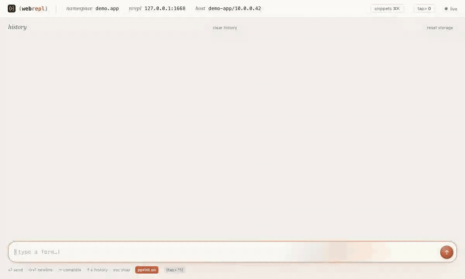

# webrepl

A browser console for the nREPL running inside a JVM. It's one [Babashka](https://babashka.org)
script plus one HTML page.



## Why

It's for a Java app that embeds an nREPL server. I wanted to open a page and land directly in
the right namespace, with my helpers already loaded and my usual snippets one click away.
The focus is Java interop: completing methods on live objects, digging into objects the way
a debugger lets you, and keeping ready-made snippets at hand.

A real editor setup does all of this and more (see [Credits](#credits)). webrepl is for when
you only need a browser tab.

## Running it

You need Babashka (tested with 1.13). That's it: no build, no deps, Babashka already ships
http-kit, bencode and cheshire.

```sh
./webrepl.clj --nrepl 127.0.0.1:5555 [--port 7899] [--notebook PATH] [--config PATH]
```

Open the `http://localhost:7899/?token=…` URL it prints. Each tab gets its own nREPL session,
started in your home namespace. If the JVM isn't up yet or goes away, the bridge keeps
retrying and reconnects on its own.

## What's in there

The editor does the usual: highlighting, rainbow parens, bracket auto-pairing, the arglists of
the call you're in, ↑/↓ through your last 100 forms. Syntax is checked by the target JVM's
reader as you type (never evaluated), so you see the unbalanced paren before you hit eval.

Eval output streams over SSE as it's produced, `esc` interrupts, results can be pretty-printed.

Completion uses what plain nREPL provides (`nrepl.util.completion`, `nrepl.util.lookup`), no
cider-nrepl needed. For `.method` completion it reflects on the actual object in the JVM, so
after `(def s (get-bean "..."))`, typing `(-> s .get` lists the real methods.

`tap>` values land in an inspector that fetches one level at a time, so tapping `(range)` or a
Hibernate entity graph won't blow up. You can also send any past result there (by identity, it
doesn't re-evaluate `*1`).

The quick-access pane (`⌘K`) turns the `(comment ...)` blocks of a notebook file into
clickable snippets, grouped by theme, plus whatever shortcuts you pin in `config.edn`.

Transcript, taps and layout survive a reload. If the bridge restarted in between, old result
ids are flagged as stale instead of pointing at the wrong value.

The header shows the target's hostname and `env.profile`; if it looks like production, the header
and the send button switch to a danger colour.

## Security

This is arbitrary eval against a live JVM, so:

- it only binds to `127.0.0.1`;
- requests need a localhost `Host` and a same-origin `Origin`/`Sec-Fetch-Site`, which rules out
  CSRF and DNS rebinding from other sites;
- other local processes need a token, stored in `~/.webrepl-token` (mode 600, delete it to
  rotate). The browser trades it for an `HttpOnly; SameSite=Strict` cookie on first visit;
- the page loads nothing external and is served with a strict CSP (nonced scripts, no framing).
  Transcripts store raw values, never HTML.

## Configuration

Copy [`config.example.edn`](config.example.edn) to `config.edn` (gitignored):

| key             | what it does                                                                 |
|-----------------|------------------------------------------------------------------------------|
| `:home-ns`      | namespace new sessions start in                                              |
| `:notebook`     | `.clj` file whose top-level `(comment ...)` forms become snippets (reread on page reload) |
| `:themes`       | `[title regex]` pairs to group snippets, first match wins; has generic defaults |
| `:quick-access` | `[title code]` pairs pinned at the top of the pane                           |
| `:starters`     | snippets shown before anything has been run                                  |

`--config` points to another file, `--notebook` overrides `:notebook`.

## Credits

Most ideas come from tools that do this properly from an editor:

- [Calva](https://calva.io) (VS Code) and [CIDER](https://cider.mx) (Emacs): REPL-driven
  workflow, inline eval, completion, rich comment forms used as notebooks.
- [Portal](https://github.com/djblue/portal), [Reveal](https://vlaaad.github.io/reveal/),
  [Morse](https://github.com/nubank/morse) (and REBL before it): `tap>`-based value inspection.
- [Clerk](https://github.com/nextjournal/clerk), [Clay](https://github.com/scicloj/clay),
  [Gorilla REPL](https://github.com/JonyEpsilon/gorilla-repl) and Jupyter: notebooks built on
  top of a REPL.
- [nREPL](https://nrepl.org), whose built-in completion and lookup ops do the heavy lifting.

## License

Copyright (c) 2026 Olivier G.

This program and the accompanying materials are made available under the terms of the
Eclipse Public License 2.0 which is available at https://www.eclipse.org/legal/epl-2.0
(see [LICENSE](LICENSE)).

This Source Code may also be made available under the following Secondary Licenses when the
conditions for such availability set forth in the Eclipse Public License, v. 2.0 are
satisfied: GNU General Public License as published by the Free Software Foundation, either
version 2 of the License, or (at your option) any later version, with the GNU Classpath
Exception which is available at https://www.gnu.org/software/classpath/license.html.

SPDX: `EPL-2.0 OR GPL-2.0-or-later WITH Classpath-exception-2.0`
